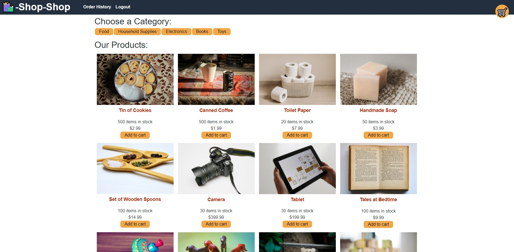

# Shop Shop Redux

## License

## Description
Shop Shop Redux is an e-commerce application that allows users to shop for various items, add items to a shopping cart, manage the shopping cart by increasing and decreasing quantities, checkout purchases, and view their order history. This application was refactored to use Redux for global state control, paired with a React front end, Node.js and Express.js back end, MongoDB database, and a Stripe payment platform.

Deployed application on heroku: https://shop-shop-redux358104.herokuapp.com/

### Screenshots

## Table of Contents
 * [Installation](#installation)
 * [Usage](#usage)
 * [Contributing](#contributing)
 * [Questions](#questions)
        
## Installation
Clone this repository and enter `npm install` in the terminal to install the necessary dependencies.
   
## Usage
Enter `npm run develop` to start the development server on `http://localhost:3000/` and use GraphQL at `http://localhost:3001/graphql`.

## Contributing
Charity Rogers

## Questions
If you have any questions, please contact me!

  - GitHub: https://github.com/rogerscl116
  - Email: rogerscl116@gmail.com 
